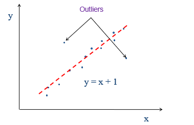
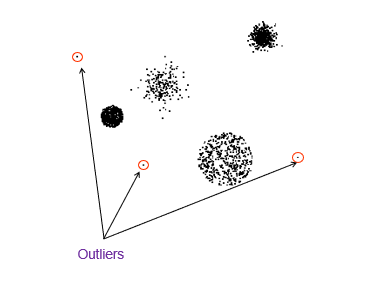
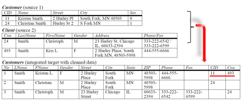

数据预处理
===

Index
---
<!-- TOC -->
- [前言](#前言)
- [数据清洗](#数据清洗)   
   - [为什么要做数据预处理](#为什么要做数据预处理)
   - [数据丢失](#数据丢失)
   - [如何处理数据丢失](#如何处理数据丢失)
   - [处理数据丢失的案例](处理数据丢失的案例)
   - [离群点](#离群点)
- [异常值和重复数据检测](#异常值和重复数据检测)
   - 
<!-- /TOC-->

## 前言
当人们说到Data Mining或者Big Data的时候，人们往往会想到各种各样的算法，像Neural Network，SVM等算法，但这一切都是有一个前提，就是数据都是存在且完备的，只需要我们去做各式各样的分析。可是实际上数据是杂乱无章的，当我们学完数据挖掘准备大干一场的时候，可能会发现所学的算法等知识并无法直接应用，其核心问题在于现实中直接获取的数据无法直接拿来使用，必须要经过预处理。

>预处理的过程
>- data cleansing(数据清洗)
>- data transformation(数据转换)
>- data description(数据描述)
>- feature selection(特征选择)
>- feature extraction(特征提取)

## 数据清洗
### 为什么要做数据预处理
   - 因为现实的数据来源不同，类型格式等不同，所以数据是非常dirty的
   - 数据预处理是数据挖掘中最大的挑战，可能会占用到整个数据挖掘项目中70%的时间
   - ‘脏’数据的种类
      - 不完整的数据（incomplete）
         - ex:问卷调查某些空没填或者填的不完整
      - 错误的数据（noisy）
         - ex:薪水一栏写负数
      - 不匹配数据（inconsistent）
         - ex:年龄填50  生日填2000/1/1  (本笔记写于2019年)
      - 冗余的数据（redundant）
         - 数据太多或者需要分析的特征太多
      - other
         - 数据的类型
         - 不平衡的数据集

### 数据丢失
   - 数据不会每次都可以收集的到
      - 收集上来的数据有很多属性值是空的
      - 许多数据挖掘的算法不能直接处理数据丢失的问题
      - 可能会导致更严重的问题
      
   - 可能的原因
      - 设备故障
      - 不愿意提供数据
         - ex:涉及到人的敏感问题的时候
      - 不适用（***Not Applicable (N/A)***）
         - 数据没有不能一定认为就是数据丢失
         - ex:男女体检，女生的一些项目男生没办法查，所以男生的体检表上就不会有这些项目的数据
          
### 如何处理数据丢失
   - 忽略
      - 直接删除掉某些属性值丢失的数据
      - 这是最简单和最直接的方法
      - 一般这些不合格的数据占样本比例很小的时侯可以这么做（<%5）
      
   - 手工填写缺少的数据
      - 重新收集一次数据
      - 利用领域的专业知识去推测
      
   - 自动填写数据
      - 填一个固定的值
      - 填一个平均值
      - 填一个最有可能的值
      
### 处理数据丢失的案例
   - 红蓝代表两个数据集，x,y是两种属性
   - 假设现在只知道x属性，y属性丢失，需要你去填补，三条线代表了三种方法
      - 黑线（中间那条）：取所有数据的平均值
      - 蓝色（下面那条）：取蓝色数据集的平均值
      - 红色（上面那条）：取红色数据集的平均值
      - 由图我们可知，图上的那个x值对应的y属性值应该是红色那条线上取，其他两个线误差比较大。但是又有另外一个问题，每次遇到这个x值我们填补的y值都是一样的，为了改善这种情况，我们以这个Y值为中点，做一个正态分布，这样既可以每次都得到不同的值，又可以没有很大的误差
  

 
### 离群点
  

  

  
  - 离群点对某些算法的影响很大，比如说最小二乘法，如果某个离群点很远，会使整体的方差很大，从而使回归的直线偏移很多
     - 最小二乘法：就是找到一条直线，让所有点到该直线的欧式距离最小
  - 离群点 vs 异常点
     -  以身高为例，姚明比我们正常人都要高许多，我们能说他是异常点吗？显然不能，是离群点。如果某些人因为患巨人症而长的很高，那才是异常点。所以说离群点和异常点还是有区别的。
  - 怎么样去定义离群点
     - 基本思路：比如我平时在班上话比较少，一天就跟同学说个三四句，如果班级氛围比较好，同学们每天都聊个热火朝天，那么就会显得我比较不合群；如果这个班的人都比较高冷，每个人跟同学每天也就聊个两三句，那么就不能说我是不合群的
     - 所有说离群不离群是个相对的概念

## 异常值和重复数据检测
  - 现实中数据有很多处的来源，这些来源中可能就会包含许多重复的数据
     - ex:一个人可能在不同的银行办过业务，那么这些银行都会留有这个人的信息，当你用数据挖掘得来的这些信息中，就很有可能包含同一个人的信息
  

  
  - 上图可以看到不同的公司对数据的管理方式可能不同，第一个公司对顾客编号的属性名叫CID，第二个公司叫Cno，但是都是表示用户编号的意思，其他的属性名也是如此，**虽然叫法不同,但是对应的意思都是一样的**，所以我们可以通过肉眼分辨出11号和493号代表的是同一个人。但是这对于计算机来说是十分困难的。
  