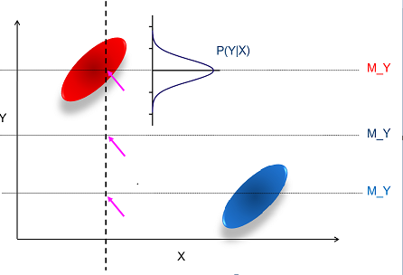

数据预处理
===

Index
---
<!-- TOC -->
- [前言](#前言)
- [数据清洗](#数据清洗)   
   - [为什么要做数据预处理](#为什么要做数据预处理)
   - [数据丢失](#数据丢失)
   - [如何处理数据丢失](#如何处理数据丢失)
   - [处理数据丢失的案例](处理数据丢失的案例)
- [异常值和重复数据检测](#异常值和重复数据检测)
<!-- /TOC-->

## 前言
当人们说到Data Mining或者Big Data的时候，人们往往会想到各种各样的算法，像Neural Network，SVM等算法，但这一切都是有一个前提，就是数据都是存在且完备的，只需要我们去做各式各样的分析。可是实际上数据是杂乱无章的，当我们学完数据挖掘准备大干一场的时候，可能会发现所学的算法等知识并无法直接应用，其核心问题在于现实中直接获取的数据无法直接拿来使用，必须要经过预处理。

>预处理的过程
>- data cleansing(数据清洗)
>- data transformation(数据转换)
>- data description(数据描述)
>- feature selection(特征选择)
>- feature extraction(特征提取)

## 数据清洗
### 为什么要做数据预处理
   - 因为现实的数据来源不同，类型格式等不同，所以数据是非常dirty的
   - 数据预处理是数据挖掘中最大的挑战，可能会占用到整个数据挖掘项目中70%的时间
   - ‘脏’数据的种类
      - 不完整的数据（incomplete）
         - ex:问卷调查某些空没填或者填的不完整
      - 错误的数据（noisy）
         - ex:薪水一栏写负数
      - 不匹配数据（inconsistent）
         - ex:年龄填50  生日填2000/1/1  (本笔记写于2019年)
      - 冗余的数据（redundant）
         - 数据太多或者需要分析的特征太多
      - other
         - 数据的类型
         - 不平衡的数据集

### 数据丢失
   - 数据不会每次都可以收集的到
      - 收集上来的数据有很多属性值是空的
      - 许多数据挖掘的算法不能直接处理数据丢失的问题
      - 可能会导致更严重的问题
      
   - 可能的原因
      - 设备故障
      - 不愿意提供数据
         - ex:涉及到人的敏感问题的时候
      - 不适用（***Not Applicable (N/A)***）
         - 数据没有不能一定认为就是数据丢失
         - ex:男女体检，女生的一些项目男生没办法查，所以男生的体检表上就不会有这些项目的数据
          
### 如何处理数据丢失
   - 忽略
      - 直接删除掉某些属性值丢失的数据
      - 这是最简单和最直接的方法
      - 一般这些不合格的数据占样本比例很小的时侯可以这么做（<%5）
      
   - 手工填写缺少的数据
      - 重新收集一次数据
      - 利用领域的专业知识去推测
      
   - 自动填写数据
      - 填一个固定的值
      - 填一个平均值
      - 填一个最有可能的值
      
### 处理数据丢失的案例
  

